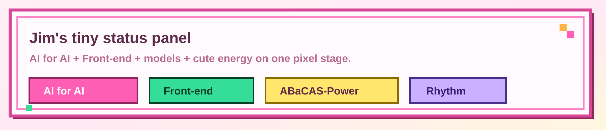
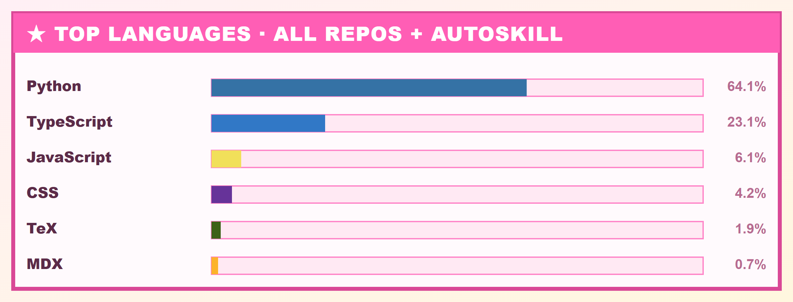

<div align="center">
  
</div>

<div align="center">
  <a href="https://jimzhang.me"></a>
  <a href="https://x.com/JimZhang32"></a>
  
  
</div>

# ☆ 你好！这里是 Jim Zhang @ wonderhoi ☆

**WONDERHOY——！** 欢迎来到我的像素舞台！这里有代码、有模型、有音乐、还有音游，全部都在闪闪发光地演出中！🌟

我现在在 **ModelBest** 做 **AI for AI**，同时也是清华环境科学方向的博士生，还是一个超～在意 **Front-end** 手感和"可爱度"的人！博士研究主线围绕 **ABaCAS-Power**：给中国城市尺度的转型路径做经济-能源-电力-电网耦合建模——认真的一面，也是舞台的一部分嘛！

<div align="center">
  <a href="https://nextjs.org"></a>
  <a href="https://react.dev"></a>
  <a href="https://www.typescriptlang.org"></a>
  <a href="https://tailwindcss.com"></a>
  <a href="https://www.python.org"></a>
</div>

## 🎤 现在舞台上正在演什么！

- 💻 在 **ModelBest** 做 AI for AI，也一直盯着面向开发者和内部系统的前端体验——系统也要做得有手感！
- ✨ 写和维护 [jimzhang.me](https://jimzhang.me)：博客、研究记录、音乐、项目、音游面板，还有一堆可爱的像素舞台实验！
- 🔬 推进 **ABaCAS-Power** 博士研究：CGE、SAM、能源需求、电力调度、GIS 电网，还有 2020–2060 的转型路径。
- 🎮 偶尔把灵感丢进前端玩具、数据脚本、音乐工程和音游战报里——灵感不演出就浪费啦！

## 🧩 技能树！

```txt
AI for AI      ████████░░  agents, self-evolving systems, workflows
Front-end      █████████░  React, Next.js, TypeScript, Tailwind CSS
Research       ████████░░  CGE, SAM, energy-power-grid modelling
Data scripts   ███████░░░  Python, data processing, visualization
Cute energy    ██████████  WONDERHOY!!!
```

<div align="center">
  
  <br />
  
</div>

> 🎀 上面这张语言卡是**自己做的**！由 [`scripts/generate-stats.mjs`](./scripts/generate-stats.mjs) 直接调 GitHub GraphQL 统计**全部仓库**（公开 + 私有）的真实语言占比，并把我在 AutoSkill 上高强度编写的那部分也算进来，再渲染成像素 SVG——不再依赖任何会限流、会挂的第三方服务啦！

## 🧭 一些入口

- 🏠 个人主页：[jimzhang.me](https://jimzhang.me)
- 🤖 公开研究 / AI 相关：[OneAtmosphere-LLM](https://github.com/BrandNewJimZhang/OneAtmosphere-LLM)
- 🕷️ 数据与爬虫小项目：[billboard-21st-century](https://github.com/BrandNewJimZhang/billboard-21st-century)
- 🧠 数理逻辑实验平台：[FormalLogicJS](https://github.com/BrandNewJimZhang/FormalLogicJS)

## 🎀 小声说

えむ一直觉得，**每一个路过这里的人，都已经是观众的一部分了！**

所以我喜欢把严肃系统做得清楚，也喜欢把个人项目做得闪闪发光。如果一个 README 也能像舞台开场一样让人笑一下，那就太好了——

<div align="center">
  <strong>☆ WONDERHOY! ☆</strong>
</div>
