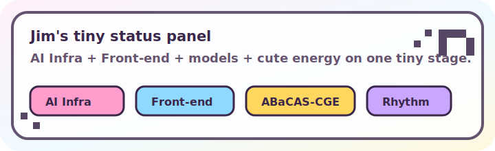

<div align="center">
  
</div>

# 你好，这里是 Jim Zhang @ wonderhoi

我现在在 **ModelBest** 做 **AI Infra**，也是清华环境科学方向博士生，同时还是一个非常在意 **Front-end** 手感和可爱度的人。  
博士研究主线围绕 **ABaCAS-CGE / ABaCAS-Power**：面向中国城市尺度转型路径的经济-能源-电力-电网耦合建模。

**WONDERHOY!!!** 代码、模型、音乐、音游，还有一个叫 [jimzhang.me](https://jimzhang.me) 的小小像素舞台。

<div align="center">
  <a href="https://jimzhang.me"></a>
  <a href="https://x.com/JimZhang32"></a>
  
  
</div>

## 现在正在做的事

- 在 **ModelBest** 做 AI Infra 相关工作，也会关注面向开发者和内部系统的前端体验。
- 写和维护 [jimzhang.me](https://jimzhang.me)：博客、研究记录、音乐、项目、音游面板和一些可爱像素舞台实验。
- 推进 **ABaCAS-CGE / ABaCAS-Power** 相关博士研究：CGE、SAM、能源需求、电力调度、GIS 电网和 2020-2060 转型路径。
- 偶尔把灵感丢进前端玩具、数据脚本、音乐工程和音游记录里。

## 技能树

```txt
AI Infra       ████████░░  systems, tools, workflows
Front-end      █████████░  React, Next.js, TypeScript, Tailwind CSS
Research       ████████░░  CGE, SAM, energy-power-grid modelling
Data scripts   ███████░░░  Python, data processing, visualization
Cute energy    ██████████  WONDERHOY!!!
```

<div align="center">
  
</div>

## 一些入口

- 个人主页：[jimzhang.me](https://jimzhang.me)
- 公开研究/AI 相关：[OneAtmosphere-LLM](https://github.com/BrandNewJimZhang/OneAtmosphere-LLM)
- 数据与爬虫小项目：[billboard-21st-century](https://github.com/BrandNewJimZhang/billboard-21st-century)
- 数理逻辑实验平台：[FormalLogicJS](https://github.com/BrandNewJimZhang/FormalLogicJS)

## 小声说

我喜欢把严肃系统做得清楚，也喜欢把个人项目做得闪闪发光。  
如果一个 README 也能像舞台开场一样让人笑一下，那就太好了。

<div align="center">
  <strong>☆ WONDERHOY! ☆</strong>
  <br />
  
</div>
